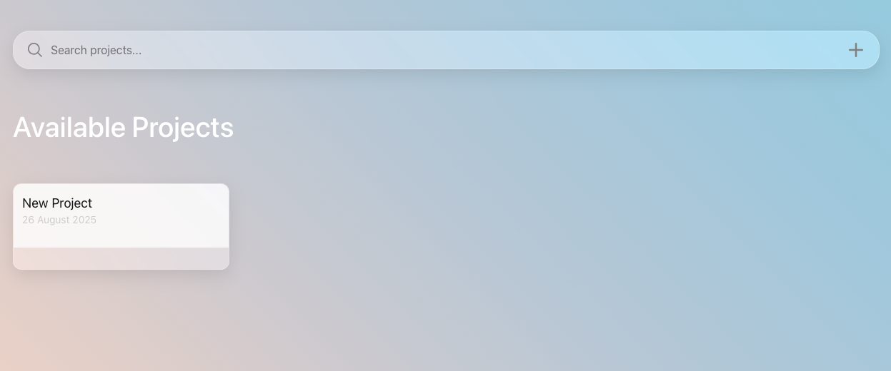
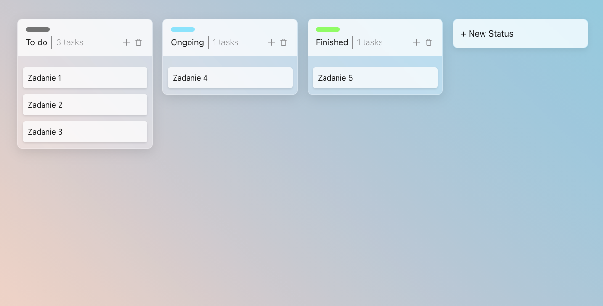

## Project & Task Management System ❗

[Polska wersja](#polska-wersja) | [English version](#english-version)

---

## Polska wersja

❗ **Praca rozwojowa**: Projekt w fazie rozwoju

Aplikacja webowa do zarządzania projektami i zadaniami. Całość aplikacji pisana jest ręcznie od zera.

**Stack technologiczny:**
`React`, `TypeScript`, `CSS`, `React Context`, `Java`, `Spring Boot`, `SQLite`, `Axios`

**Aktualne funkcjonalności:**

- Dodawanie i usuwanie projektów
- Dodawanie i usuwanie statusów
- Dodawanie i usuwanie zadań
- Przeciąganie zadań pomiędzy statusami

---

## English version

❗ **Work in progress**: Project under development

A web application for managing projects and tasks. The entire application is written manually from scratch.

**Tech stack:**
`React`, `TypeScript`, `CSS`, `React Context`, `Java`, `Spring Boot`, `SQLite`, `Axios`

**Current features:**

- Adding and deleting projects
- Adding and deleting statuses
- Adding and deleting tasks
- Drag & drop tasks between statuses

---

## Screenshots

Dashboard View [work in progress]

Project View [work in progress]

